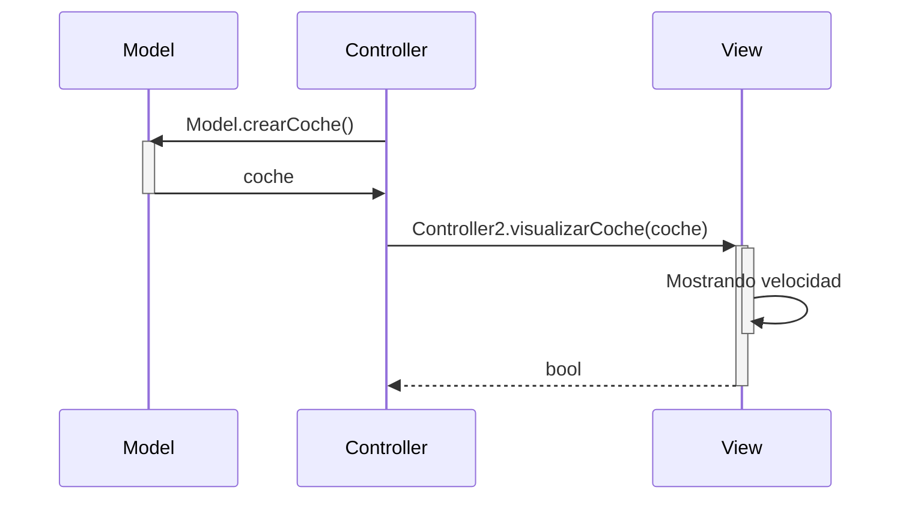

```mermaid
sequenceDiagram 
    participant Model
    participant Controller
    participant View

    Controller->>Model: Model.crearCoche()
    activate Model
    Model->>Controller: coche
    deactivate Model
    Controller->>+View: Controller2.visualizarCoche(coche)
    activate View
    View->>-View:Mostrando velocidad
    View-->>Controller: bool
    deactivate View

```
